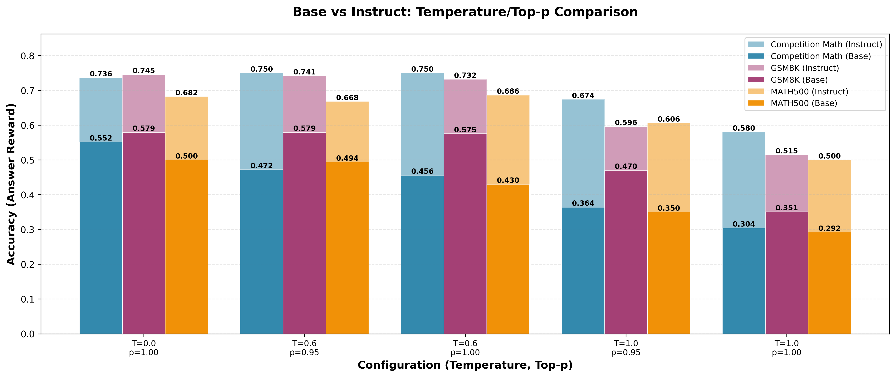

# 评测一下不同 Temperature/Top-p 对基础模型生成效果的影响

    
    <caption>测试了五组 Temperature/Top-p 在 Qwen2.5-Math-1.5B 及 Qwen2.5-Math-1.5B-Instruct 上的表现 </caption>

- [visualize_results.py](../scripts/visualize_results.py) 将 [eval_t_topp.sh](../scripts/eval_t_topp.sh) 和 [eval_t_topp1.sh](../scripts/eval_t_topp1.sh) 的结果可视化出来，结果如上图所示；
- [print_results_table.py](../scripts/print_results_table.py) 直接将结果文件的 summary.json 中的 aggregate_metrics 打印出来，如下表所示

结论：

- 奖励方面：
    *   在 Answer Reward（答案准确性）方面，`Qwen2.5-Math-1.5B-Instruct` 模型在所有超参数设置和数据集上的表现均远超基础模型 `Qwen2.5-Math-1.5B`。【可以说明Instruct的训练在答案准确性还是提升很多的】
    *   在 Format Reward（格式正确性）方面，基础模型 `Qwen2.5-Math-1.5B` 的得分远高于指令微调模型。【指令微调后的模型遗忘了原来模型指令遵循的的能力，及时把temperature调高也无济于事】
- 超参数方面：
    *   对于 Answer Reward，较低的 `temperature`（如 0.0 或 0.6）通常能带来更好的结果。当 `temperature` 升高到 1.0 时，两个模型的答案准确性都出现了明显下降。
    *   对于 Format Reward，`temperature` 对基础模型的影响较大，`temperature=0.0` 时得分最高；而对指令微调模型的影响则不明显，其得分普遍很低。

对比[Qwen2.5](https://arxiv.org/pdf/2409.12122)中的实际结果：

原论文是：
- `Qwen2.5-Math-1.5B` 
    - gsm8k(8-shot)=76.8
    - MATH(4-shot)=49.8
- `Qwen2.5-Math-1.5B-Instruct`(CoT)
    - gsm8k(zero-shot,pass@1)=84.8
    - MATH(zero-shot,pass@1)=75.8

我们所测得的实际最好结果是：
- `Qwen2.5-Math-1.5B`
    - gsm8k(zero-shot,pass@1)=57.9 (T=0,top_p=1/T=0.6,top_p=0.95)
    - MATH(zero-shot,pass@1)=55.2 (T=0,top_p=1)
- `Qwen2.5-Math-1.5B-Instruct`
    - gsm8k(zero-shot,pass@1)=74.5 (T=0,top_p=1)
    - MATH(zero-shot,pass@1)=75.0 (T=0.6,top_p=0.95/1.0)

如果考虑由于prompt_template带来的误差，我们用的不是CoT的模版("system": "Please reason step by step, and put your final answer within \\boxed{}.") ，并且考虑 few-shot learning 带来的性能提升估计的话，这里的评测结果还是可以对的上原文的评测结果的；

启发:
1. 后续打算就使用 temperature=0.6, top_p=0.95 作为初始的 rollout settings 去 reasoning了；
2. 肯定还是用指令微调之前的 Base 模型来进行训练，之后训练完模型之后就可以直接在现在的基础上看对比 base model 怎么样，对比 instruct model 怎么样，现在相当于把自己的benchmark已经写的差不多了，后续打算也测试一下deepseek的蒸馏模型效果如何；

## Appendix

### Answer Reward by Model Config and Dataset

| Model Config                                       |   competition_math |    gsm8k |   math500 |
|:---------------------------------------------------|-------------------:|---------:|----------:|
| Qwen2.5-Math-1.5B-Instruct-temperature0.0-topp1.0  |              0.736 | 0.745262 |     0.682 |
| Qwen2.5-Math-1.5B-Instruct-temperature0.6-topp0.95 |              0.75  | 0.741471 |     0.668 |
| Qwen2.5-Math-1.5B-Instruct-temperature0.6-topp1.0  |              0.75  | 0.731615 |     0.686 |
| Qwen2.5-Math-1.5B-Instruct-temperature1.0-topp0.95 |              0.674 | 0.595906 |     0.606 |
| Qwen2.5-Math-1.5B-Instruct-temperature1.0-topp1.0  |              0.58  | 0.514784 |     0.5   |
| Qwen2.5-Math-1.5B-temperature0.0-topp1.0           |              0.552 | 0.579227 |     0.5   |
| Qwen2.5-Math-1.5B-temperature0.6-topp0.95          |              0.472 | 0.579227 |     0.494 |
| Qwen2.5-Math-1.5B-temperature0.6-topp1.0           |              0.456 | 0.575436 |     0.43  |
| Qwen2.5-Math-1.5B-temperature1.0-topp0.95          |              0.364 | 0.470053 |     0.35  |
| Qwen2.5-Math-1.5B-temperature1.0-topp1.0           |              0.304 | 0.351024 |     0.292 |

### Format Reward by Model Config and Dataset

| Model Config                                       |   competition_math |      gsm8k |   math500 |
|:---------------------------------------------------|-------------------:|-----------:|----------:|
| Qwen2.5-Math-1.5B-Instruct-temperature0.0-topp1.0  |              0     | 0          |     0.004 |
| Qwen2.5-Math-1.5B-Instruct-temperature0.6-topp0.95 |              0.004 | 0.00227445 |     0.002 |
| Qwen2.5-Math-1.5B-Instruct-temperature0.6-topp1.0  |              0.002 | 0.00530705 |     0.006 |
| Qwen2.5-Math-1.5B-Instruct-temperature1.0-topp0.95 |              0.004 | 0.0060652  |     0.006 |
| Qwen2.5-Math-1.5B-Instruct-temperature1.0-topp1.0  |              0.002 | 0.0015163  |     0     |
| Qwen2.5-Math-1.5B-temperature0.0-topp1.0           |              0.488 | 0.780895   |     0.506 |
| Qwen2.5-Math-1.5B-temperature0.6-topp0.95          |              0.402 | 0.576194   |     0.444 |
| Qwen2.5-Math-1.5B-temperature0.6-topp1.0           |              0.424 | 0.544352   |     0.392 |
| Qwen2.5-Math-1.5B-temperature1.0-topp0.95          |              0.312 | 0.334344   |     0.27  |
| Qwen2.5-Math-1.5B-temperature1.0-topp1.0           |              0.21  | 0.278999   |     0.214 |
