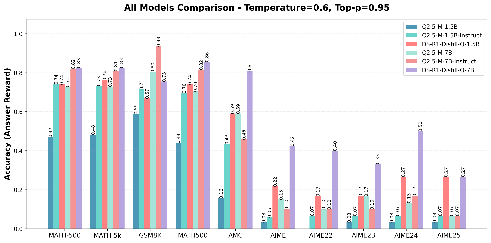
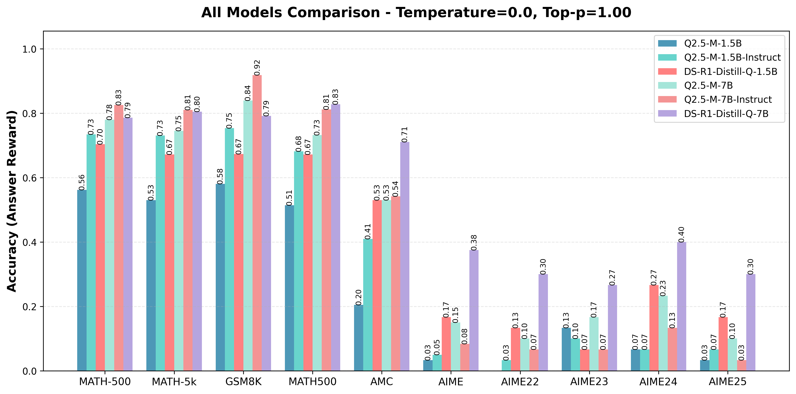

# Custom Benchmarks

<div align="center">
    
    </br>
    
    </br>
    <caption>Evaluation of Base/Instruct/Distill Qwen 1.5B/7B Model on Math/GSM8K/AMC/AIME</caption>
</div>


- [save_eval_datasets.py](../scripts/save_eval_datasets.py) 从现有的数据集中搭建了自己的 benchmarks，方便后续评测; 其中 math500 是openai当时用的评测数据集，而自己用 seed 42 重新在 competition-math(Math) 采样了500/5000条数据集
- [eval_models.sh](../scripts/eval_models.sh) 评测了 Qwen2.5-Math 的 1.5B/7B Base/Instruct Model, DeepSeek 的 1.5B/7B Distill Model, 在 amc/aime/math500/competition_math/gsm8k 数据集上（[save_eval_datasets.py](../scripts/save_eval_datasets.py)中保存的数据集）进行评测

执行下面的程序可以简单加载查看一下评测数据集；

```python
from datasets import load_dataset

# ...existing code...
data_paths = [
    # eval datasets
    # {'path': 'AI-MO/aimo-validation-amc', 'split': 'train'},
    # {'path': 'AI-MO/aimo-validation-aime', 'split': 'train'},
    # {'path': 'opencompass/AIME2025', 'name': 'AIME2025-I', 'split': 'test'},
    # {'path': 'opencompass/AIME2025', 'name': 'AIME2025-II', 'split': 'test'},
    # {'path': 'qwedsacf/competition_math', 'split': 'train'},
    # {'path': 'openai/gsm8k', 'name': 'main', 'split': 'test'},
    # {'path': 'HuggingFaceH4/MATH-500', 'split': 'test'}
    {
        'path': "json",
        'data_files': "data/eval/competition_math_500/test.jsonl",
        'split': "train"
    },
    {
        'path': "json",
        'data_files': "data/eval/competition_math_5k/test.jsonl",
        'split': "train"
    },
    {
        'path': "json",
        'data_files': "data/eval/aime/test.jsonl",
        'split': "train"
    },
    {
        'path': "json",
        'data_files': "data/eval/aime22/test.jsonl",
        'split': "train"
    },
    {
        'path': "json",
        'data_files': "data/eval/aime23/test.jsonl",
        'split': "train"
    },
    {
        'path': "json",
        'data_files': "data/eval/aime24/test.jsonl",
        'split': "train"
    },
    {
        'path': "json",
        'data_files': "data/eval/aime25/test.jsonl",
        'split': "train"
    },
    {
        'path': "json",
        'data_files': "data/eval/amc/test.jsonl",
        'split': "train"
    },
    {
        'path': "json",
        'data_files': "data/eval/math500/test.jsonl",
        'split': "train"
    },
    {
        'path': "json",
        'data_files': "data/eval/gsm8k/test.jsonl",
        'split': "train"
    },
]

for data_args in data_paths:
    print(f"Loading dataset from {data_args['data_files']}...")
    raw_dataset = load_dataset(**data_args)
    print(raw_dataset)
    print(raw_dataset[0])

# python demo.py
```