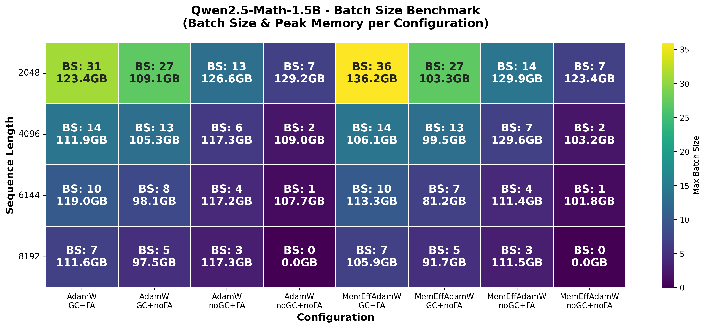

# 小实验：最大可用的 Batch Size

- [batch_size_check](../scripts/batch_size_check.py) 目前测试了 memory_efficient adamw, gradient_checkpointing, flash_attention_2 对 Qwen2.5-Math-1.5B bfloat16 能开的最大 batch_size 的影响（训练三个steps作为测试）；
- [batch_size_visualize](../scripts/batch_size_visualize.py) 绘制不同长度(2048,4096,6144,8192), 不同配置 (if memory_efficient) adamw x (if gradient_checkpointing) model x (if flash_attention_2) model, 一共 (4,2x2x2) 组实验，每组实验显示其使用二分搜索搜到的最大的 batch_size 和 peak_memory

<div align="center">
    
</div>

- 结论： MemEffAdamW GC+FA 的效果最好，seq_length = 2048 远比 seq_length = 8192 的四倍还要好
- 启发： 后续去生成一下 response_length < 2048 和 response_length < 4096 的 omr12k 数据

```bash
export CUDA_VISIBLE_DEVICES=3
uv run demo.py --compare --seq_length 2048
uv run demo.py --compare --seq_length 4096
uv run demo.py --compare --seq_length 6144
uv run demo.py --compare --seq_length 8192
```